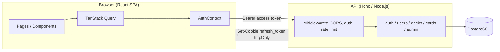

# 🧭 Lumora — Visão Técnica Completa do Projeto

Este documento reúne, em um só lugar, tudo o que existe hoje no projeto: arquitetura, backend, segurança, frontend, infraestrutura, funcionalidades e a discussão sobre um possível servidor MCP para o produto. Serve como referência viva — atualize sempre que uma decisão importante mudar.

> Para o guia rápido de "como rodar o projeto", veja o [`README.md`](../README.md). Para a especificação original de produto, veja [`especificacao-flashcards-app.md`](../especificacao-flashcards-app.md).

---

## 1. Visão geral

Lumora é um site de flashcards de estudo (pergunta/resposta/explicação/analogia), com dois minigames de revisão, categorização de decks, um catálogo público de decks ("Explorar") e um painel de administração básico. Uso pessoal/entre amigos, sem fins comerciais.



---

## 2. Backend

### 2.1 Stack e organização

- **Framework**: [Hono](https://hono.dev) rodando sobre Node.js (via `@hono/node-server` em dev/Docker, e adaptado para serverless na Vercel).
- **Entradas do servidor**:
  - [`api/_app.ts`](../api/_app.ts) — monta o app Hono, CORS, logger, rotas e error handler global.
  - [`api/_server.ts`](../api/_server.ts) — bootstrap local (Node server) usado em `npm run dev:api` / Docker.
  - [`api/index.ts`](../api/index.ts) — handler de entrada para a Vercel (serverless function).
- **Rotas** (`api/_routes/`):
  | Arquivo | Prefixo | Endpoints principais |
  |---|---|---|
  | `auth.ts` | `/api/auth` | `POST /register`, `POST /login` (com rate limit), `POST /refresh`, `POST /logout` |
  | `users.ts` | `/api/users` | `GET /me`, `PATCH /me`, `GET /` (admin, listar usuários), `PATCH /:id` (admin) |
  | `decks.ts` | `/api/decks` | `GET /` (meus decks), `GET /saved`, `GET /public`, `GET /:id`, `POST /`, `PATCH /:id`, `DELETE /:id`, `POST /:id/save`, `DELETE /:id/save`, `GET /:id/quiz`, `POST /:id/session` (salvar resultado de partida) |
  | `cards.ts` | `/api/cards` | `POST /`, `PATCH /:id`, `DELETE /:id`, `POST /:id/image` |
  | `admin.ts` | `/api/admin` | `GET /settings` (público), `PUT /settings/:key`, `PUT /settings` (batch, admin) |
- **Validação de entrada**: [Zod](https://zod.dev) via `@hono/zod-validator` (`zValidator('json', schema)`) em praticamente todas as rotas que recebem body — rejeita payloads malformados antes de tocar no banco.
- **Banco de dados**: PostgreSQL + [Drizzle ORM](https://orm.drizzle.team). Schema declarado em [`api/_db/schema.ts`](../api/_db/schema.ts), sincronizado via `drizzle-kit push` (sem migrations SQL versionadas — schema-as-code).
- **Seeds**: scripts em `api/_db/seed.ts`, `seed-devops.ts`, `seed-teste2.ts`, `check-decks.ts`, `cleanup-test2.ts` para popular/depurar dados de desenvolvimento.

### 2.2 Modelo de dados

```
users            — conta, hash de senha, role (user/admin), tema, displayName, occupation
refresh_tokens   — um registro por refresh token emitido (jti, expiresAt, revoked) — permite revogação/rotação
decks            — nome, descrição, owner, isPublic, category (principal) + extra_categories[], dificuldade, pin (emoji/label)
cards            — pergunta, resposta, explicação, analogia, imagem, dificuldade, posição (ordem), pertence a um deck
saved_decks      — N:N entre users e decks públicos salvos por outros usuários (índice único user+deck)
site_settings    — chave/valor para customização global do site (título, cores, imagem de fundo)
game_sessions    — histórico de partidas: usuário, deck, tipo de jogo, score, total de cards, acertos
```

Relações (Drizzle `relations()`): `users 1—N decks`, `users 1—N cards`, `users 1—N refreshTokens`, `users N—N decks` (via `savedDecks`), `decks 1—N cards`.

### 2.3 Regras de negócio relevantes

- Um deck tem **uma categoria principal** (`category`) e pode ter **categorias adicionais** (`extraCategories: string[]`), permitindo aparecer em múltiplos filtros da página Explorar mantendo uma categoria "canônica" para exibição no card.
- Decks só aparecem em `/decks/public` se `isPublic = true`.
- Qualquer usuário autenticado pode **salvar** um deck público de outro usuário (`saved_decks`), e ele passa a aparecer no Dashboard e no seletor de jogos, junto com o nome do criador original.
- O modo Quiz precisa de **pelo menos 2 cards** no deck (para gerar distratores de múltipla escolha); a UI mostra essa exigência de forma explícita quando o deck não atinge o mínimo.
- Suporte a **jogo multi-deck**: rotas `/play/quiz?decks=id1,id2,...` e `/play/hold?decks=...` combinam cards de vários decks em uma única sessão (o primeiro deck da lista é o "primário" para fins de navegação/salvar sessão).

---

## 3. Segurança

Resumo do que já está implementado, mapeado (informalmente) ao OWASP Top 10:

| Preocupação | O que existe hoje |
|---|---|
| **Autenticação** | JWT próprio com **dois tokens**: access token (15 min, em memória/`sessionStorage` no client) e refresh token (7 dias, cookie **HttpOnly + SameSite=Strict** + `Secure` em produção). Nunca expomos o refresh token ao JS do cliente. |
| **Hash de senha** | `argon2id` (via lib `argon2`), memory-hard, resistente a GPU cracking. Nunca guardamos senha em texto puro. |
| **Timing attack no login** | Quando o e-mail não existe, ainda assim rodamos um `argon2.hash('dummy', ...)` para gastar tempo equivalente e não vazar, pelo tempo de resposta, se o e-mail existe ou não. |
| **Revogação/rotação de refresh token** | Cada refresh token tem um `jti` único gravado em `refresh_tokens`. A cada uso em `/auth/refresh`, o token antigo é marcado `revoked = true` e um novo é emitido (rotação) — mitiga replay de token roubado. `logout` revoga o token atual. |
| **Autorização** | Middlewares `requireAuth` (qualquer usuário logado) e `requireAdmin` (checa `role === 'admin'` a partir do payload do JWT, não de um valor vindo do client) em `api/_middleware/auth.ts`. |
| **Rate limiting** | `rateLimitLogin` (Upstash Redis, sliding window 5 tentativas / 15 min por IP) protege `/auth/login` contra brute-force. Se as env vars do Upstash não estiverem configuradas, o limitador é desabilitado silenciosamente (modo dev). |
| **Validação de entrada** | Zod em todas as rotas de mutação — tipos, tamanhos máximos (`.max(...)`), formatos (e-mail, hex color, URL http(s)) validados antes de qualquer lógica de negócio. Evita injeção de dados malformados e parte do risco de mass assignment. |
| **SQL Injection** | Mitigado estruturalmente: todo acesso a dado passa pelo Drizzle ORM com queries parametrizadas — não há concatenação de SQL cru em nenhuma rota. |
| **CORS** | Restrito à origem configurada em `FRONTEND_URL` (+ localhost em dev), com `credentials: true` e métodos/headers explícitos — não é `origin: '*'`. |
| **Cookies sensíveis** | Refresh token em cookie `HttpOnly` (inacessível a JS, mitigando roubo via XSS) + `SameSite=Strict` (mitiga CSRF) + `Secure` em produção (só via HTTPS). |
| **Least privilege em admin** | Endpoints administrativos (`/admin/settings` PUT, `/users` listagem/edição) exigem `requireAdmin`; `GET /admin/settings` é público pois é necessário para estilizar a home antes do login. |
| **Erros e vazamento de informação** | Handler global (`app.onError`) captura exceções, normaliza mensagens (não vaza stack trace para o cliente) e trata especificamente falhas de conexão com o banco com uma mensagem operacional genérica. |
| **Superfície de configuração admin** | `PUT /admin/settings/:key` usa uma allowlist fixa de chaves (`ALLOWED_KEYS`) — não é possível gravar chaves arbitrárias na tabela `site_settings`. |

### Pontos de atenção / dívidas de segurança conhecidas

- Segredos JWT (`ACCESS_TOKEN_SECRET`, `REFRESH_TOKEN_SECRET`) têm um valor default de desenvolvimento hardcoded no código — **precisam ser sobrescritos** por variável de ambiente em qualquer ambiente exposto publicamente.
- Não há CSRF token explícito para rotas mutantes autenticadas via cookie (mitigado parcialmente por `SameSite=Strict`, mas o ideal a médio prazo é um double-submit token se o site crescer).
- Rate limiting cobre login; outras rotas de escrita (registro, criação de deck/card) ainda não têm limitação de taxa dedicada.
- Upload de imagem (`POST /cards/:id/image`) deve ser revisado quanto a validação de tipo/tamanho de arquivo e origem (verificar implementação atual antes de expor publicamente).

---

## 4. Frontend

### 4.1 Stack

- **React 18 + TypeScript + Vite**.
- **Roteamento**: `react-router-dom` v7 ([`src/App.tsx`](../src/App.tsx)), com três grupos de rotas:
  - Públicas: `/`, `/login`, `/register`, `/explore`.
  - Protegidas (`ProtectedRoute`): `/dashboard`, `/decks/:id`, `/decks/:id/play/hold`, `/decks/:id/play/quiz`, `/play/hold`, `/play/quiz` (multi-deck), `/profile`.
  - Admin-only (`ProtectedRoute adminOnly`): `/admin`.
- **Estado de servidor**: TanStack Query (cache, refetch, mutations) — ver `src/lib/api.ts` para os clients (`authApi`, `decksApi`, `savedDecksApi`, etc.).
- **Estado de autenticação**: `AuthContext` ([`src/contexts/AuthContext.tsx`](../src/contexts/AuthContext.tsx)) — guarda `token` (access token) e `user`, expõe `login`, `register(email, password, displayName, occupation?)`, `logout`; access token fica em `sessionStorage`, refresh acontece via cookie httpOnly automaticamente.
- **UI Kit**: [shadcn/ui](https://ui.shadcn.com) (Radix + Tailwind) em `src/components/ui/`.
- **Estilo**: Tailwind CSS + CSS customizado em `src/index.css` (tema claro/escuro via variáveis HSL, efeito "glass" opcional com imagem de fundo, animação de flip-card).

### 4.2 Páginas principais

| Página | Rota | Descrição |
|---|---|---|
| `Home` | `/` | Landing pública, customizável pelo admin (título, textos, cor/imagem de fundo). |
| `Login` / `Register` | `/login`, `/register` | Login simples; cadastro em **2 etapas** (1: e-mail+senha com medidor de força; 2: nome de exibição + ocupação opcional). |
| `Explore` | `/explore` | Catálogo público de decks (`GET /decks/public`), com filtros multi-seleção de categoria e dificuldade, nome do criador e botão de salvar/dessalvar (bookmark). |
| `Dashboard` | `/dashboard` | Meus decks + decks salvos, criação/edição de decks (com categorias adicionais), lançador de jogos (`GameLaunchDialog`) combinando decks próprios e salvos. |
| `DeckPage` | `/decks/:id` | CRUD de cards de um deck, expandir/colapsar card ao clicar. |
| `QuizGame` | `/decks/:id/play/quiz`, `/play/quiz?decks=...` | Minigame de múltipla escolha, com timer por questão e pontuação. |
| `HoldAndAnswerGame` | `/decks/:id/play/hold`, `/play/hold?decks=...` | Minigame "Segura e Responde" (flip-card manual: acertou/errou). |
| `Profile` | `/profile` | Dados da conta do usuário (nome, ocupação, cor tema). |
| `AdminPage` | `/admin` | Configurações globais do site e gestão de usuários (admin only). |

### 4.3 Detalhes de UX implementados

- Card do deck mostra badge da **categoria principal** junto com contagem de cards.
- Botão "Jogar" fica desabilitado com badge "+2 cards" quando o deck não atinge o mínimo para o Quiz.
- Navbar mostra `displayName` do usuário (ou o prefixo do e-mail como fallback) e um link "Explorar" com ícone.
- Ordenação alfabética de categorias (`localeCompare('pt-BR')`) em todos os seletores.

---

## 5. Infraestrutura / Dev Experience

### 5.1 Ambientes

- **Desenvolvimento local**: `docker-compose.yml` sobe dois serviços:
  - `db`: `postgres:16-alpine`, com healthcheck via `pg_isready`.
  - `app`: build a partir do [`Dockerfile`](../Dockerfile) (Node 22 alpine), monta o código como volume (hot reload), roda `npm install && npm run db:push && npm run dev` — API na porta `3001`, Vite na `5173`.
- **Produção**: Vercel (`vercel.json`) — rewrites de `/api/*` para a function `/api/index`, headers de `Cache-Control: no-store` nas rotas de API.
- **CI** (`.github/workflows/ci.yml`): em push/PR para `main` roda dois jobs:
  1. `test`: checkout → setup Node 22 → `npm ci` → `npm run typecheck` → `npm test -- --run` → `npm run build`.
  2. `e2e`: sobe um serviço Postgres via `services:` do Actions, injeta as envs necessárias e roda os testes Playwright de fluxo crítico.
- Segundo workflow, `vercel-deploy.yml`, cuida do deploy automatizado para a Vercel.

### 5.2 Scripts npm relevantes

```
dev            # API (tsx watch) + Vite em paralelo (concurrently)
dev:setup      # copia .env, faz db:push e db:seed
db:push        # sincroniza schema Drizzle -> Postgres
db:studio      # abre o Drizzle Studio
db:seed        # popula dados de exemplo
docker:up      # docker compose up --build
test / test:e2e / typecheck / build
```

---

## 6. Funcionalidades — resumo consolidado

- Cards com pergunta, resposta, explicação, analogia e imagem opcional.
- Decks com categoria principal + categorias adicionais, dificuldade e visibilidade pública/privada.
- Página **Explorar**: descoberta de decks públicos de outros usuários, com filtros e "salvar" (bookmark).
- **Decks salvos**: aparecem no Dashboard e no seletor de jogos junto com os decks próprios, mostrando o criador original.
- Dois minigames: **Quiz** (múltipla escolha, tempo, pontuação, suporte a multi-deck) e **Segura e Responde** (flip-card manual, também com suporte a multi-deck).
- Histórico de partidas (`game_sessions`) por deck/usuário.
- Cadastro em duas etapas (credenciais → perfil).
- Customização de tema por usuário e configurações globais de site pelo admin (título, textos, cor/imagem de fundo).
- Painel admin com gestão de usuários e configurações do site.

---

## 7. Discussão: um servidor MCP para o Lumora

Durante o desenvolvimento, discutimos se o projeto se beneficiaria de um **[MCP](https://modelcontextprotocol.io) (Model Context Protocol) server próprio** — ou seja, um serviço que expõe "ferramentas" de IA que tanto assistentes (como este) quanto a própria aplicação poderiam invocar de forma padronizada.

**Conclusão da discussão**: sim, o Lumora se beneficiaria de um MCP server dedicado. Ideias concretas levantadas:

- **Geração de conteúdo**
  - `generate_cards(topic, count, difficulty)` — dado um tema (ex.: "React Hooks"), gera automaticamente N flashcards já com pergunta, resposta, explicação e analogia prontos para revisão.
  - `improve_card(question, answer)` — sugere melhorias em cards já existentes (clareza, precisão, didática).

- **Estudo adaptativo**
  - `suggest_deck(occupation, weak_areas)` — sugere quais decks estudar com base na ocupação do usuário e no desempenho histórico (via `game_sessions`).
  - `explain_analogy(card_id)` — aprofunda/expande a analogia de um card considerado difícil.

- **Busca semântica**
  - `search_cards(query)` — busca cards por similaridade semântica em vez de apenas correspondência textual exata (ex.: "memória cache" também encontraria cards sobre Redis, RAM, buffer).

- **Integração com fontes externas**
  - `import_from_pdf(url)` — importa conteúdo de PDFs/apostilas e converte automaticamente em flashcards.
  - `fetch_wikipedia_summary(topic)` — gera cards a partir de resumos de artigos da Wikipédia.

**Como isso se encaixaria na arquitetura atual**: o frontend chamaria uma rota nova da própria API (ex.: `POST /api/ai/generate-cards`), que por sua vez invocaria o MCP server (local ou na nuvem) e devolveria os cards gerados para o usuário **revisar antes de salvar** — mantendo o humano no loop antes de qualquer persistência no banco.

> Status: **ideia discutida, ainda não implementada.** Nenhuma rota `/api/ai/*` ou servidor MCP existe hoje no código. Este bloco documenta a decisão de produto para retomarmos quando for priorizado.

---

## 8. Onde encontrar cada coisa (mapa rápido)

```
api/_app.ts                   → montagem do Hono, CORS, error handler
api/_server.ts / api/index.ts → entrypoints (Node local / Vercel serverless)
api/_lib/jwt.ts                → assinatura/verificação de access e refresh tokens
api/_middleware/auth.ts        → requireAuth / requireAdmin
api/_middleware/rateLimit.ts   → rate limit de login (Upstash)
api/_db/schema.ts              → schema Drizzle (fonte da verdade do modelo de dados)
api/_routes/*.ts                → handlers HTTP por domínio
src/contexts/AuthContext.tsx  → estado de sessão no frontend
src/lib/api.ts                → clients HTTP tipados (fetch + TanStack Query)
src/pages/*.tsx                → telas da aplicação
src/components/ui/*           → design system (shadcn/ui)
docker-compose.yml / Dockerfile → ambiente de desenvolvimento
.github/workflows/*           → CI/CD
```
